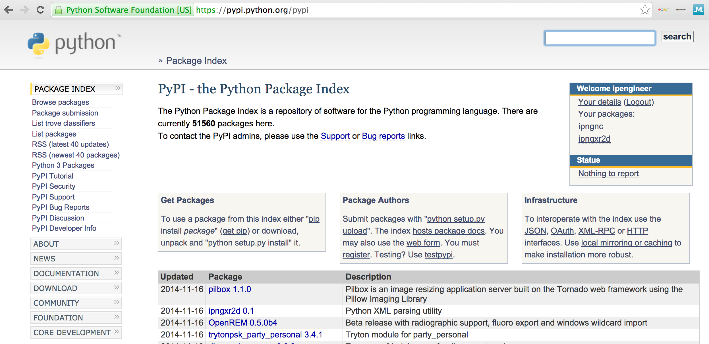

# SmartImport

## Project Description

An unsupervised analysis combining topic modeling, clustering, cosine similrity, and word2vec to provide recommendations of python packages to use in your project based on your README.md file and README.md files of those found in Github.

[Image source](http://ipengineer.net/wp-content/uploads/2014/11/pypi.png)

---

## Motivation

The number of libaries added to the official Python Package Index (PyPI) is growing larger and larger everyday. For new (and even experienced) users, understanding what packages are available to the public and/or what packages are commonly used for their current task can be a difficult undertaking. To make that process easier, this process compares your current README.md file description to those of other projects found on Github to match your project to a cluster of similar projects. From there, recommendations can be provided on what libraries other individuals are commonly using for similar tasks as well as what libraries are commonly imported together.

---

## Data Sources

- [Github](https://github.com/) is a web-based Git or version control repository and Internet hosting service mostly used for code.

---

## Libraries Utilized

- github, pymongo - Use the Github api to upload the top python repositories on Github to MongoDB in AWS
- pandas, json, re - Clean-up text files and extract necessary components (import statements, select file types, etc.)
- nltk, gensim, scikit-learn, spark - Peform data cleansing (stop words, stemming), create LDA topic model, create TF-IDF matrics, and calculate cosine distance

---

## Process
  1. Upload files from top python repositories from Github api to MongoDB in AWS
  2. Clean data set (remove stop words, punctuations, etc., apply stemming)
  3. Create LDA topic model from cleaned corpus of resumes
  4. Cluster corpus of repository README files based on their topics
  5. Apply same pre-processing transformations to intended target repository README file
  6. Match target repo to cluster of similar repos and extract most commonly imporeted libraries/packages to provide as recommendations
  7. Using word2vec and cosine similarity, if import statements already provided in current project, provide further recommendations based on README and libraries imported 

---

## Results
- Original [presentation](static/smartimport.pdf) delivered on 09/15/2016
